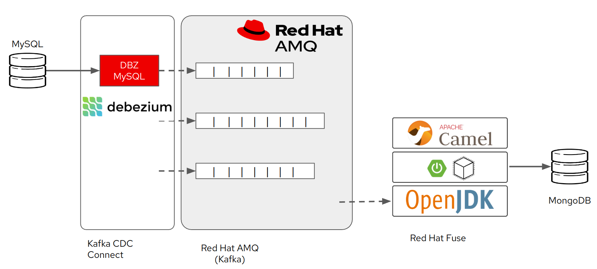

# CDC Fuse Demo

This fuse demo application developed using camel spring boot.  It consumes CDC kafka topics and updates the change history to MongoDB.




## Project structure
```
├── mvnw
├── mvnw.cmd
├── pom.xml
├── README.md
└── src
    ├── main
    │   ├── java
    │   │   └── com
    │   │       └── redhat
    │   │           └── fusedemo
    │   │               ├── FusedemoApplication.java
    │   │               ├── FuseDemoCDCRouteBuilder.java
    │   │               └── FuseDemoCUDRouteBuilder.java
    │   └── resources
    │       └── application.properties
    └── test
        └── java
            └── com
                └── redhat
                    └── fusedemo
                        └── FuseDemoRouteBuilderTest.java
```

## Prerequisites
------------------------------------------------
1) MySQL server available for CDC target
2) Kafka server with MySQL debezium connector configured
3) MongoDB available to update target
4) Update the src/main/resources/application.properties file
   - database servers and credentials
   - kafka topics

## Compile requirements
1) Java OpenJDK 11 or above install with JAVA_HOME environment
3) Maven 3.8 installed

## Build with testKafkaConsumerCDCRoute test
------------------------------------------------
Insert cdc history to MongoDB collection
```
./mvnw -Dtest=FuseDemoRouteBuilderTest#testKafkaConsumerCDCRoute clean test
```

## Build with testKafkaConsumerCUDRoute test
------------------------------------------------
Insert / Update / Delete of CDC to MongoDB collection
```
./mvnw -Dtest=FuseDemoRouteBuilderTest#testKafkaConsumerCDCRoute clean test
```

## Package FuseDemoRouteBuilder
------------------------------------------------
```
./mvnw clean package -DskipTests=true
```

## Run Fuse Spring Boot app
------------------------------------------------
```
java -jar target/fuse-demo-service-0.0.1-SNAPSHOT.jar
```
